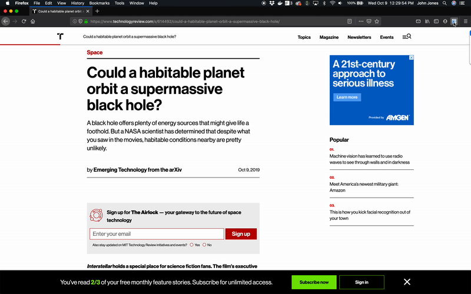

# Standard Notes Clipper

[](https://travis-ci.org/johnjones4/Standard-Notes-Clipper)
[](https://standardjs.com)



This is a browser add-on (Firefox and Chrome) that allows you to clip web pages to your Standard Notes account. The add-on let's you select the portion of the page you want to clip. It then adds the HTML content of that selection to your Standard Notes account.

Please use and share your feedback! And, of course, contributions are welcome!  

## Installation

### Firefox

Download the latest `firefox.xpi` file from [releases](https://github.com/johnjones4/Standard-Notes-Clipper/releases). Then, go to _Tools_ > _Add-ons_, and click the gear icon and select _Install Add-on From File_ from the menu. Now go to your downloads folder and select the `firefox.xpi` file.

### Chrome

Download the latest `chrome.zip` file from [releases](https://github.com/johnjones4/Standard-Notes-Clipper/releases) and unzip it. Go to _Window_ > _Extensions_, then click _Load unpacked_ and drive to the unzipped folder and click _Select_.

## Building and Running from Source

To build the plugin from source, execute the following:

```bash
# git clone git@github.com:johnjones4/Standard-Notes-Clipper.git
# cd Standard-Notes-Clipper
# npm install
# npm run build
```

### Firefox

Go to _Tools_ > _Add-ons_, then click the gear icon and select _Debug Addons_ from the menu. On the _Add-ons_ debug page, click _Load Temporary Add-on..._ and drive to folder containing this project's `build` folder and select the `_manifest.json` file. 

### Chrome

Go to _Window_ > _Extensions_, then click _Load unpacked_ and drive to folder containing this project's `build` folder and click _Select_. 
